# Windows-Server-AD-Lab-macOS
A complete virtualization of a Windows Server 2022 environment and Windows 11 client, demonstrating Active Directory configuration, DNS management, and virtual networking troubleshooting on Intel-based hardware.

# Project Overview
This project documents the deployment of a virtualized Windows Server environment on macOS using VMware Fusion. The goal is to build a functional Active Directory (AD) environment to practice systems administration, identity management, and networking.

## Phase 1: Installation & Initial Configuration
### Hypervisor Setup
Resource Allocation: Each VM is allocated 2 CPU cores and 4GB of RAM to ensure smooth performance on a 16GB host.
Installation Method: Used a manual installation approach rather than "Easy Install" to prevent licensing and configuration errors during the Windows setup wizard.
VMware Tools: Installed VMware Tools on both guest operating systems to enable clipboard sharing, smooth cursor movement, and optimized display drivers.

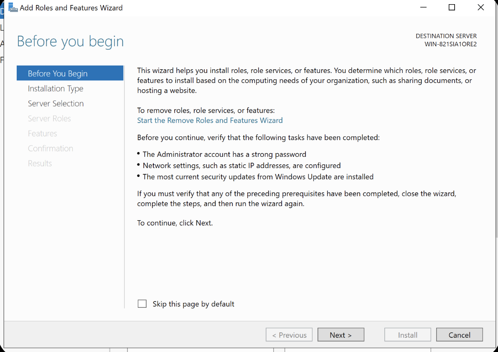

### Networking & Connectivity
Network Type: Configured both VMs to use NAT (Share with my Mac) to provide internet access while maintaining an isolated virtual network.

### Troubleshooting Connectivity:
Issue: Initial ping requests from the Windows 11 client to the Server timed out.
Root Cause: Windows Defender Firewall was blocking ICMP traffic by default.
Resolution: Temporarily disabled the firewall on the Server to verify Layer 3 connectivity and ensure seamless domain joining in later steps.

### Static IP & DNS Configuration
To ensure the stability of the Domain Controller, the Server's IP address was "frozen" with a static configuration.

### Network Configuration
| Component | IP Address | Purpose |
| :--- | :--- | :--- |
| **Domain Controller** | `192.168.211.10` | Primary AD DS / DNS Server |
| **Default Gateway** | `192.168.211.2` | Virtual Router (VMware NAT) |
| **DNS (Server)** | `127.0.0.1` | Local Loopback for AD services |
| **DNS (Client)** | `192.168.211.10` | Points Client to DC for name resolution |

---

## Phase 2: Role Installation & Conflict Resolution
### Role Selection
The goal was to install the core "brains" of the network. I selected:
1. **AD DS (Active Directory Domain Services):** The central identity database.
2. **DNS Server:** Essential for resolving domain names to IP addresses.
3. **AD CS (Certificate Services):** Initially installed for digital identity management.

### Troubleshooting the "Order of Operations"
During the promotion process, a prerequisite check failed because **AD CS** was installed as a "Standalone" authority before the domain existed.
* **Issue:** Conflict between Standalone AD CS and Root Domain Controller promotion.
* **Resolution:** 1. Utilized the "Remove Roles and Features" wizard to uninstall AD CS.
    2. Successfully passed the AD DS prerequisite check.
    3. Re-installation of AD CS is deferred until after the domain is established (as an Enterprise CA).

### The Problem
The prerequisite check failed because a "Certificate Server" was already installed on the local machine.
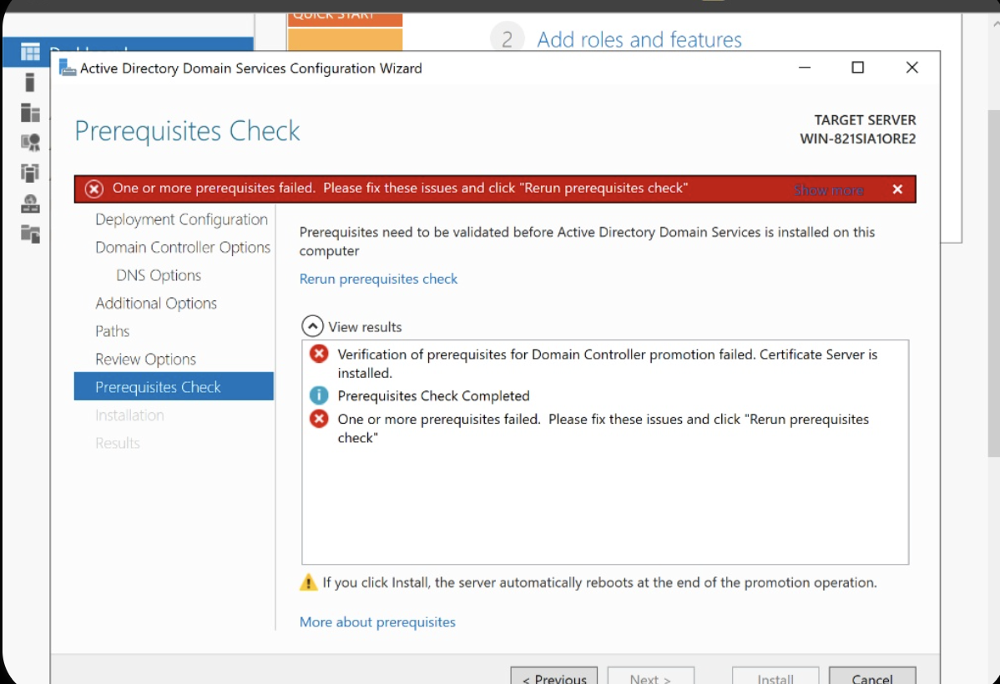

### The Resolution
I utilized the "Remove Roles and Features Wizard" to uninstall the AD CS role. 
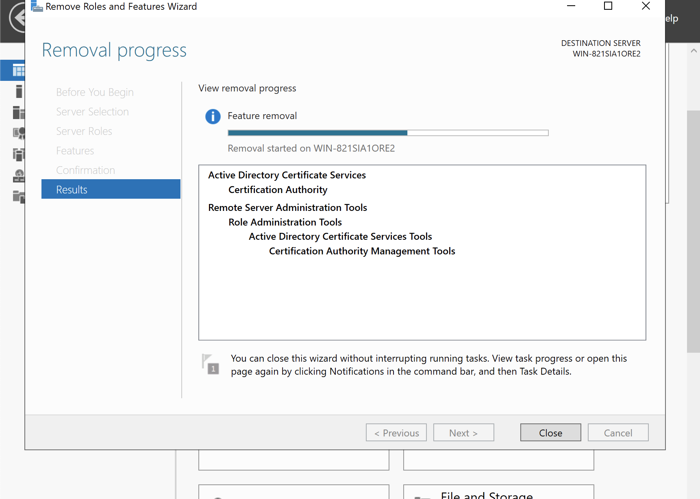

Once removed, the prerequisites check passed successfully, allowing the installation to proceed.
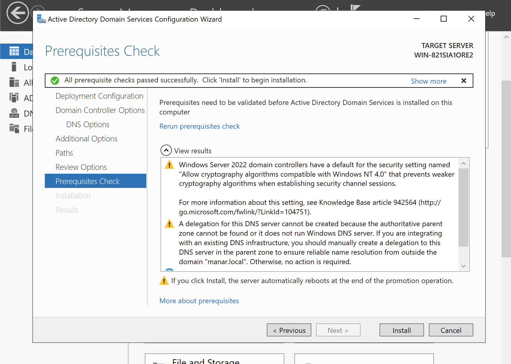

---

## Phase 3: Domain Controller Promotion
### Initializing the Forest
The server was promoted from a standalone workgroup machine to a **Domain Controller**.
* **Deployment:** Created a new Forest named `manar.local`.
* **Functional Level:** Set to **Windows Server 2016** to ensure a balance between modern features and legacy compatibility.
* **DSRM Security:** Configured a secure Directory Services Restore Mode password for emergency database maintenance.

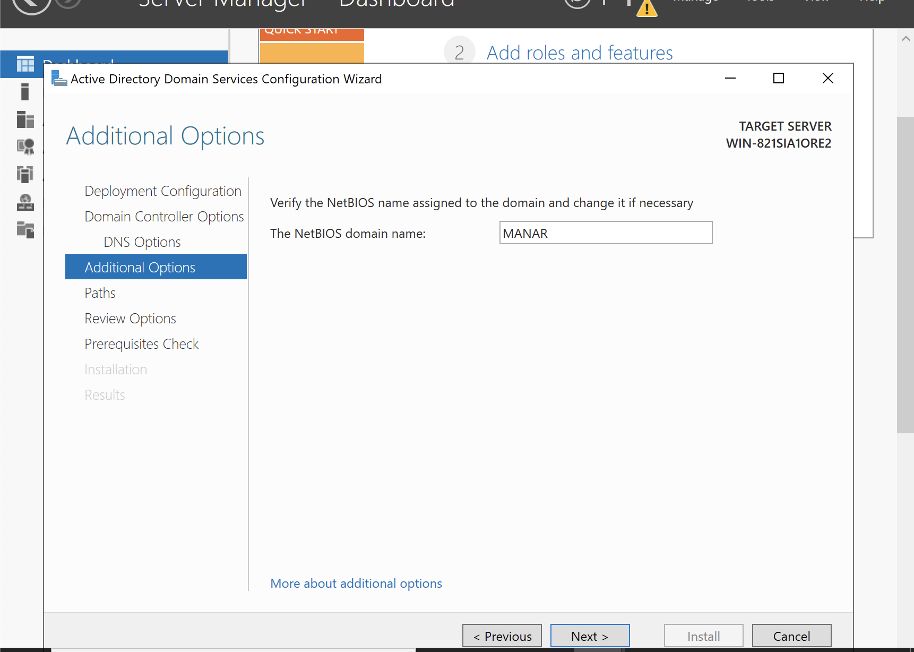
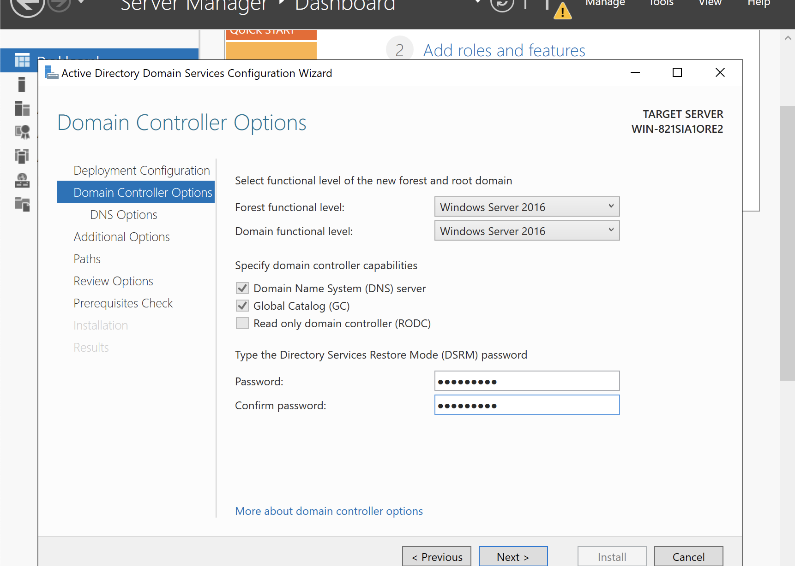

### Results
Upon successful promotion and reboot, the server now authenticates users against the `MANAR` domain. 

**Verification:** The login screen now displays `MANAR\Administrator`, confirming that the Active Directory database is active and managing local security.

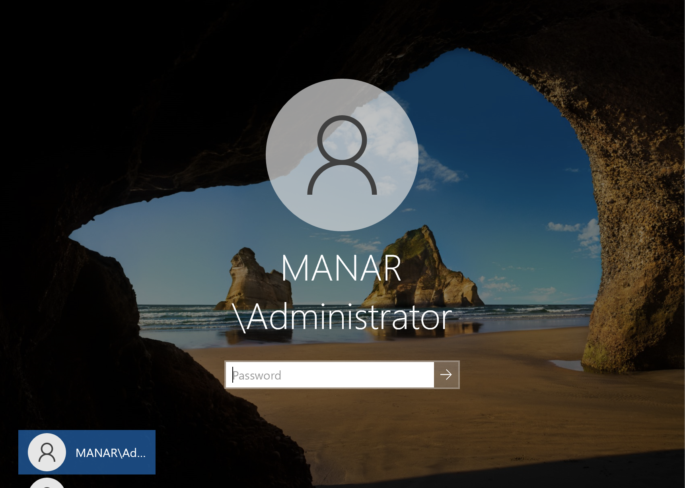

---

## Technical Concept: The "Hierarchy"
* **The Domain Controller (This VM):** The central management office holding the keys and employee ledger.
* **Member Servers (Future VMs):** Specialized worker servers (File, Web, SQL) that join the domain to follow the DC's rules.
* **Users & Groups:** Logical objects created within the DC to manage human access to network resources.

---

## Phase 4: Client Integration & User Management
The final stage of the lab involved moving from a single server setup to a functional client-server network.

### Joining the Windows 11 Workstation
To bring the Windows 11 machine into the domain, I manually configured its IPv4 DNS settings to point to the Domain Controller's IP (`192.168.211.10`). This allowed the client to resolve the `manar.local` name and successfully join the forest.

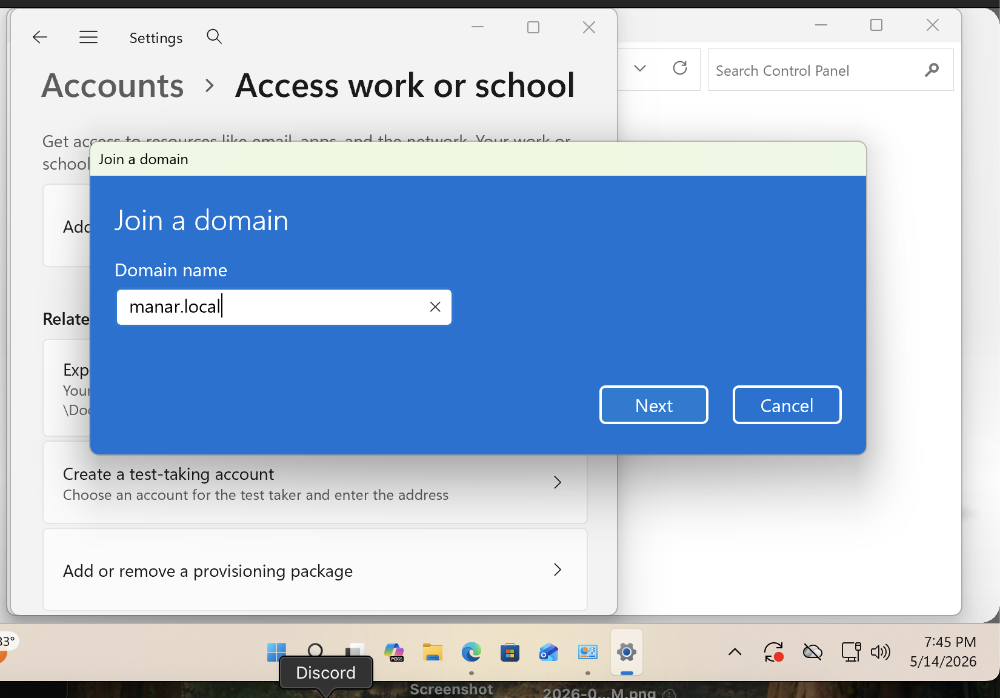

### User Administration
In an enterprise environment, using the Domain Administrator account for daily tasks is a security risk. I utilized **Active Directory Users and Computers (ADUC)** to create a non-privileged "Standard User" for daily workstation access.

* **User Created:** `MANAR\LabUser`
* **Security Principle:** Applied the "Least Privilege" model by ensuring this account lacks local administrative rights on the workstation.

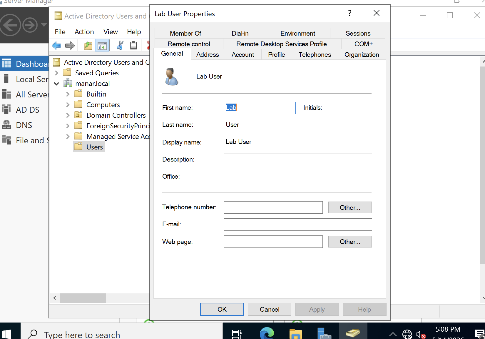

---

## Final Verification
The lab was successfully verified by logging into the Windows 11 workstation using the newly created domain credentials. This confirms:
1. **Network Connectivity:** Proper communication between the Guest VMs.
2. **DNS Resolution:** The client successfully found the DC.
3. **Authentication:** The Domain Controller successfully validated the user's identity.

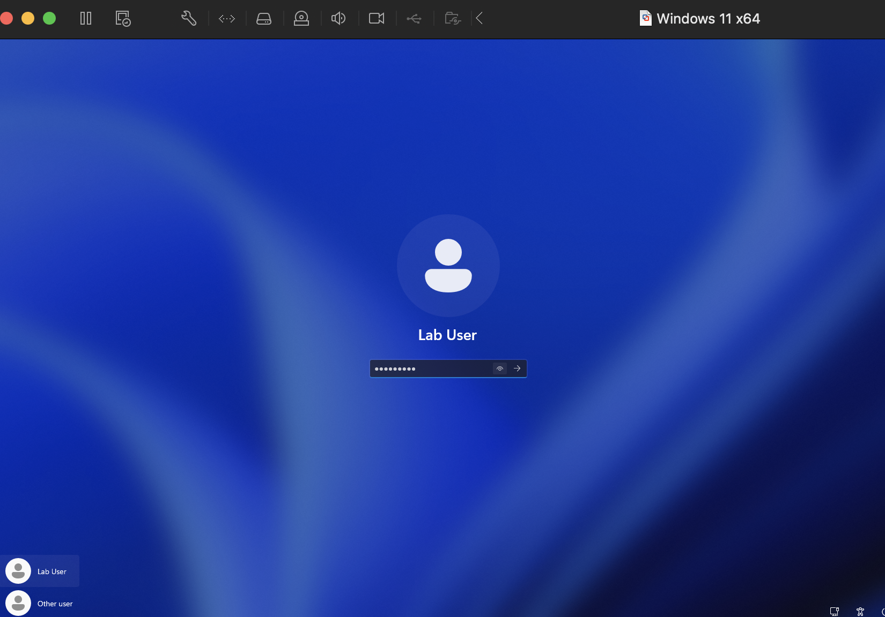

# Windows-Server-AD-Lab-macOS

A complete virtualization of a Windows Server 2022 environment and Windows 11 client, demonstrating Active Directory configuration, DNS management, and virtual networking troubleshooting on Intel-based hardware.

# Project Overview
This project documents the deployment of a virtualized Windows Server environment on macOS using VMware Fusion. The goal is to build a functional Active Directory (AD) environment to practice systems administration, identity management, and networking.

## Phase 1: Installation & Initial Configuration
### Hypervisor Setup
* **Resource Allocation**: Each VM is allocated 2 CPU cores and 4GB of RAM to ensure smooth performance on a 16GB host.
* **Installation Method**: Used a manual installation approach rather than "Easy Install" to prevent licensing and configuration errors during the Windows setup wizard.
* **VMware Tools**: Installed VMware Tools on both guest operating systems to enable clipboard sharing, smooth cursor movement, and optimized display drivers.

### Networking & Connectivity
* **Network Type**: Configured both VMs to use NAT (Share with my Mac) to provide internet access while maintaining an isolated virtual network.

### Troubleshooting Connectivity:
* **Issue**: Initial ping requests from the Windows 11 client to the Server timed out.
* **Root Cause**: Windows Defender Firewall was blocking ICMP traffic by default.
* **Resolution**: Temporarily disabled the firewall on the Server to verify Layer 3 connectivity and ensure seamless domain joining in later steps.

### Static IP & DNS Configuration
To ensure the stability of the Domain Controller, the Server's IP address was "frozen" with a static configuration.

### Network Configuration
| Component | IP Address | Purpose |
| :--- | :--- | :--- |
| **Domain Controller** | `192.168.211.10` | Primary AD DS / DNS Server |
| **Default Gateway** | `192.168.211.2` | Virtual Router (VMware NAT) |
| **DNS (Server)** | `127.0.0.1` | Local Loopback for AD services |
| **DNS (Client)** | `192.168.211.10` | Points Client to DC for name resolution |

---

## Phase 2: Role Installation & Conflict Resolution
### Role Selection
The goal was to install the core "brains" of the network. I selected:
1. **AD DS (Active Directory Domain Services):** The central identity database.
2. **DNS Server:** Essential for resolving domain names to IP addresses.
3. **AD CS (Certificate Services):** Initially installed for digital identity management.

### Troubleshooting the "Order of Operations"
During the promotion process, a prerequisite check failed because **AD CS** was installed as a "Standalone" authority before the domain existed.
* **Issue:** Conflict between Standalone AD CS and Root Domain Controller promotion.
* **Resolution:** 1. Utilized the "Remove Roles and Features" wizard to uninstall AD CS. 2. Successfully passed the AD DS prerequisite check. 3. Re-installation of AD CS is deferred until after the domain is established (as an Enterprise CA).

### The Problem
The prerequisite check failed because a "Certificate Server" was already installed on the local machine.

### The Resolution
I utilized the "Remove Roles and Features Wizard" to uninstall the AD CS role. 

Once removed, the prerequisites check passed successfully, allowing the installation to proceed.

---

## Phase 3: Domain Controller Promotion
### Initializing the Forest
The server was promoted from a standalone workgroup machine to a **Domain Controller**.
* **Deployment:** Created a new Forest named `manar.local`.
* **Functional Level:** Set to **Windows Server 2016** to ensure a balance between modern features and legacy compatibility.
* **DSRM Security:** Configured a secure Directory Services Restore Mode password for emergency database maintenance.

### Results
Upon successful promotion and reboot, the server now authenticates users against the `MANAR` domain. 

**Verification:** The login screen now displays `MANAR\Administrator`, confirming that the Active Directory database is active and managing local security.

---

## Phase 4: Client Integration & User Management
The lab moved from a single server setup to a functional client-server network.

### Joining the Windows 11 Workstation
To bring the Windows 11 machine into the domain, I manually configured its IPv4 DNS settings to point to the Domain Controller's IP (`192.168.211.10`). This allowed the client to resolve the `manar.local` name and successfully join the forest.

### User Administration
In an enterprise environment, using the Domain Administrator account for daily tasks is a security risk. I utilized **Active Directory Users and Computers (ADUC)** to create a non-privileged "Standard User" for daily workstation access.

* **User Created**: `MANAR\LabUser`
* **Security Principle**: Applied the "Least Privilege" model by ensuring this account lacks local administrative rights on the workstation.

---
## Phase 5: Advanced System Administration
This phase demonstrates enterprise-level management focusing on organization and automated policy enforcement.

### Organizational Unit (OU) Hierarchy
To prepare for scalable management, I moved default objects into a custom OU structure. This allows for targeted policy application based on department or object type.
* **Users OU**: `MANAR_Users`
* **Computers OU**: `MANAR_Computers`

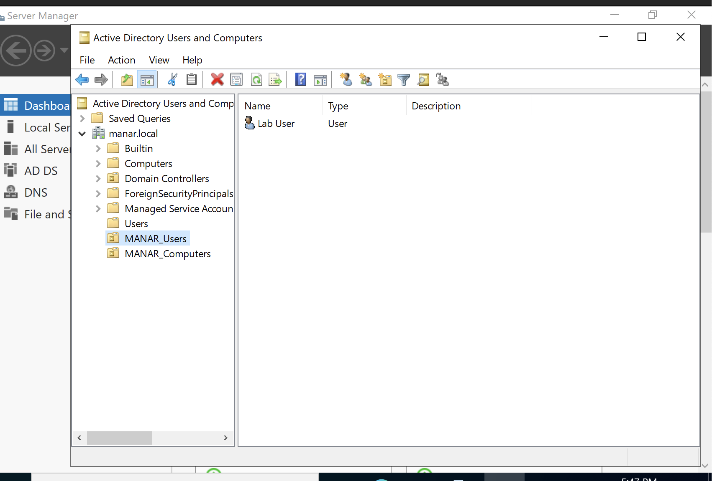
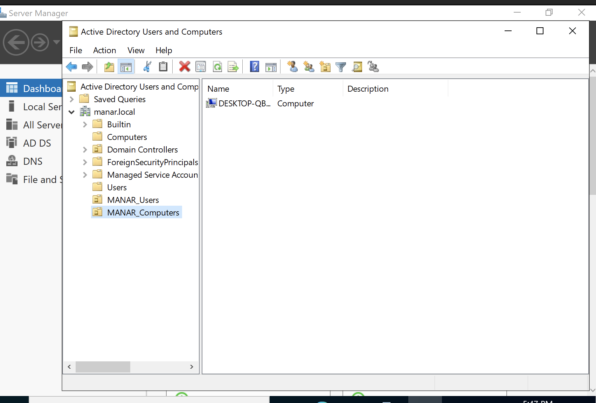

### Group Policy Objects (GPOs)
I implemented a restrictive security policy using the **Group Policy Management Console (GPMC)** to demonstrate administrative control over the client environment.

* **Policy Name**: `Restrict_Control_Panel`
* **Configuration**: Enabled "Prohibit access to Control Panel and PC settings" under User Administrative Templates.
* **Deployment**: Linked the GPO directly to the `MANAR_Users` OU.

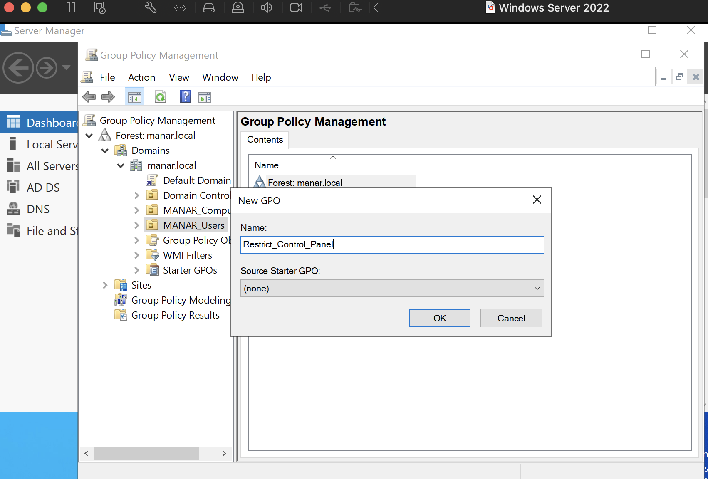
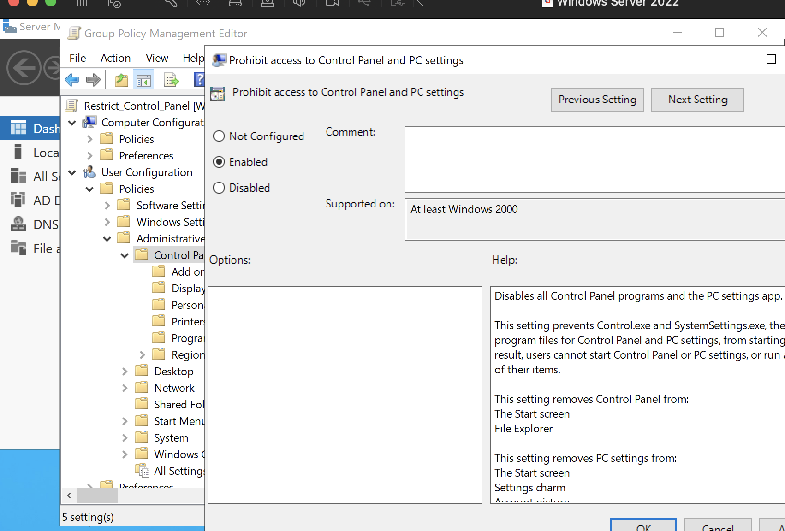

### Policy Enforcement & Verification
To verify deployment, I utilized the `gpupdate /force` command on the Windows 11 workstation.

* **The Result**: The client successfully blocked access to system settings, confirming the Domain Controller is managing the endpoint.

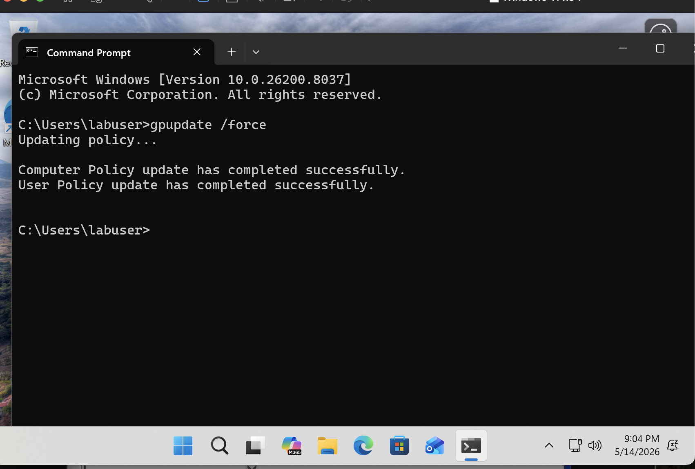
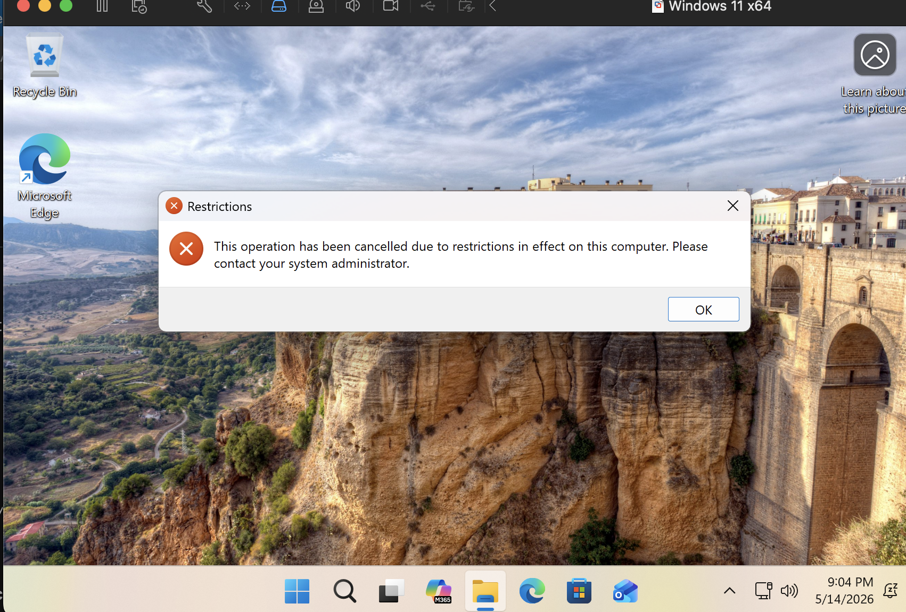

---

## Phase 6: File Server & NTFS Security
This phase demonstrates the management of network resources and the enforcement of data security policies by creating a centralized "Department Share."

### Secure File Sharing Implementation
1. **Directory Creation**: Created `C:\Company_Data` on the Windows Server 2022 instance.
2. **Network Sharing**: Configured **Advanced Sharing** to make the folder visible over the network to the "Everyone" group with Read permissions.
3. **NTFS Permissions**: Navigated to the **Security** tab to add `MANAR\LabUser`. To maintain data integrity, I granted only **Read & execute** permissions and explicitly ensured **Write** and **Modify** were unselected.

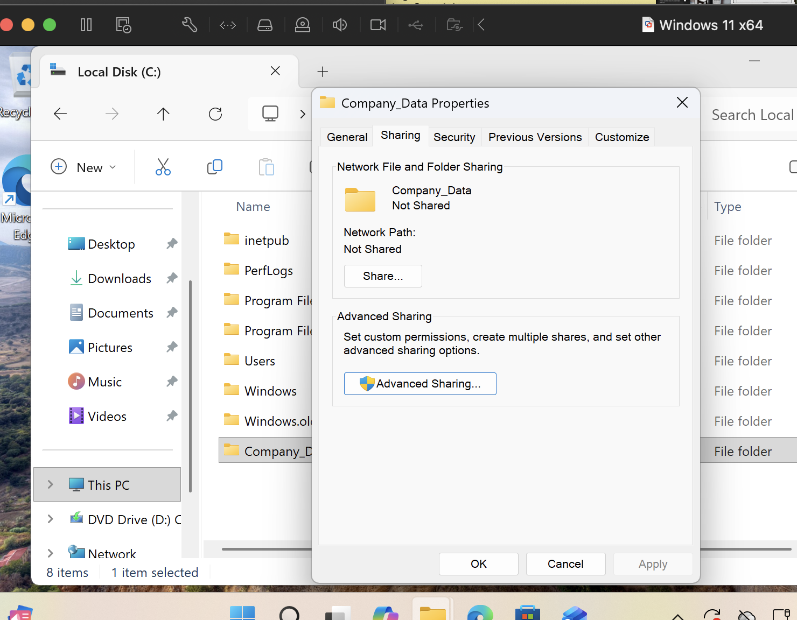
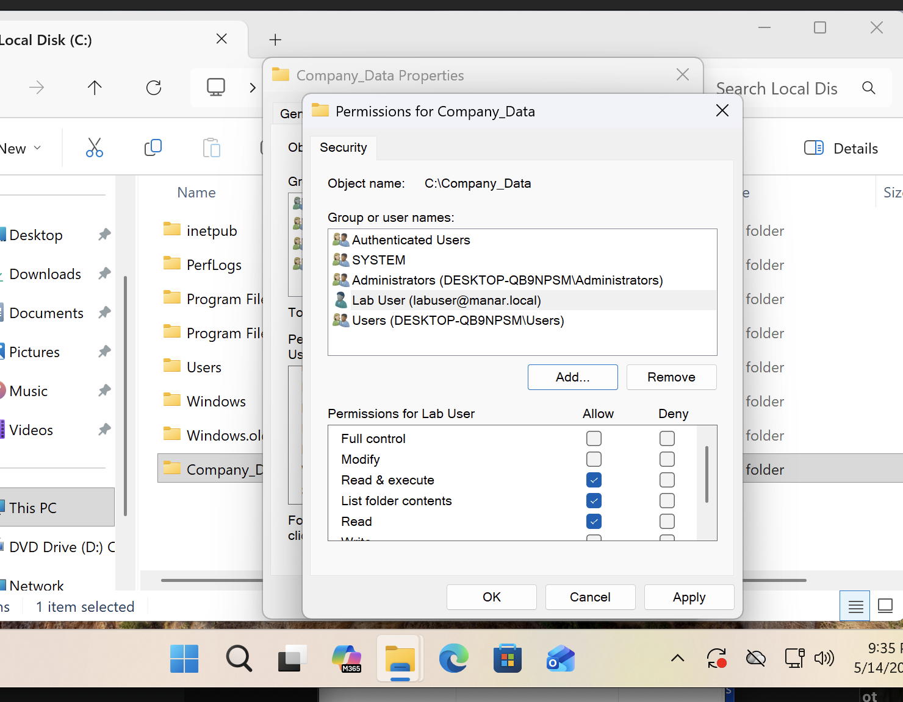

### Verification & Proof of Concept
To test the security configuration, I accessed the share from the Windows 11 workstation using the path `\\192.168.211.10\Company_Data`.

* **The Test**: Attempted to delete a file created by the Administrator.
* **The Result**: Windows returned a **"Destination Folder Access Denied"** error, confirming that the security permissions correctly restricted the standard user from destroying company data.

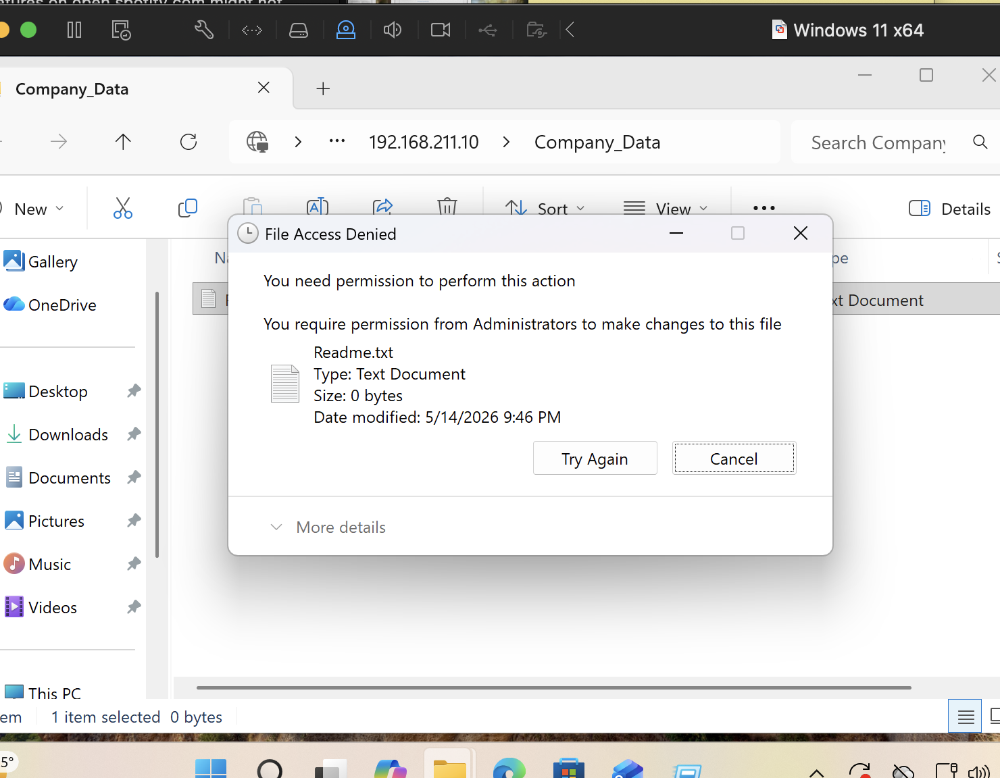

---

## Technical Competencies
* **Virtualization**: Management of Windows Server 2022 and Windows 11 guests on macOS.
* **Identity Management**: AD DS Forest initialization and OU/Object structuring.
* **Policy Automation**: Deployment and enforcement of Group Policy Objects (GPOs).
* **Data Security**: Implementation of the "Least Privilege" model via NTFS and Network Share permissions.
* **Network Administration**: Static IP configuration and DNS troubleshooting.
